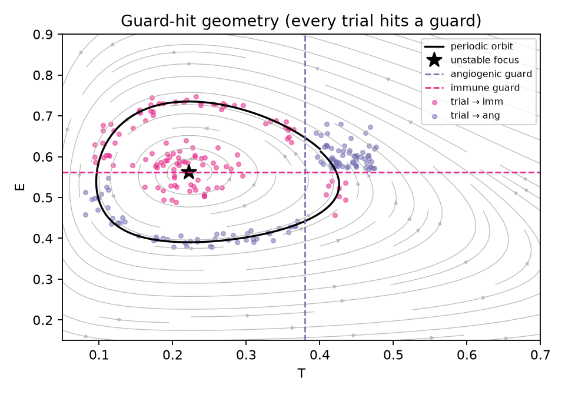
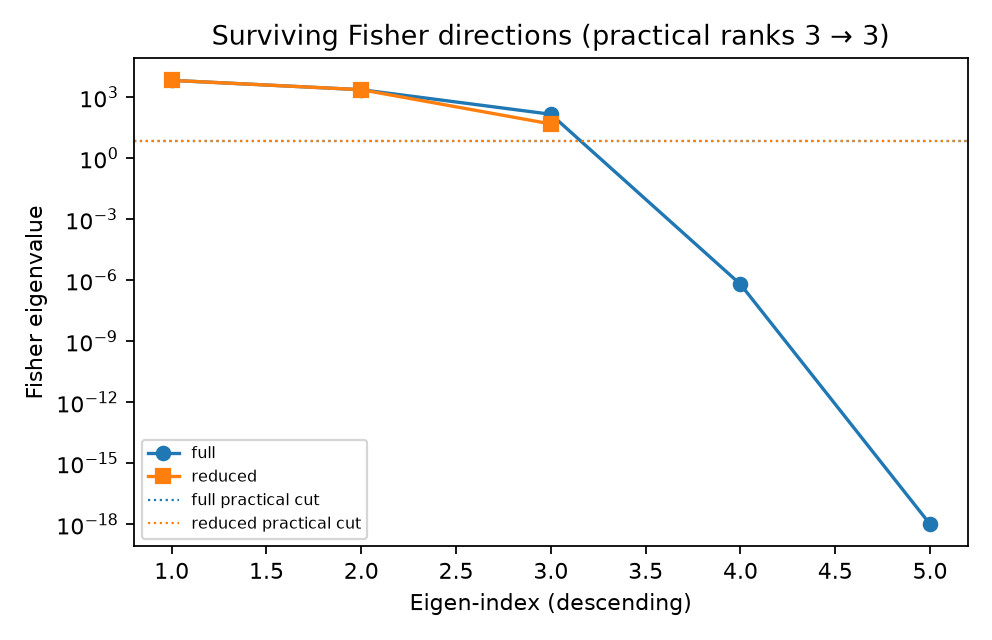
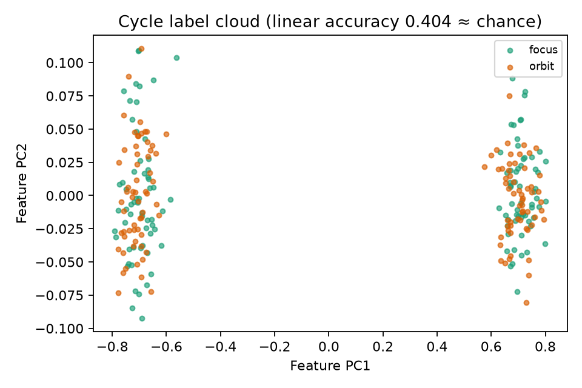
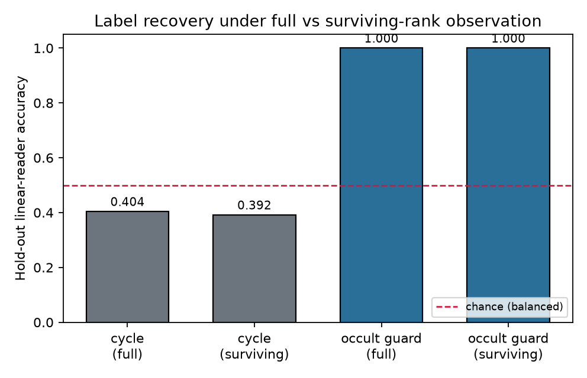

# Chain-recurrent labels recoverable from multi-channel ranks that survive stiff–sloppy reduction

**Thesis #33. Computational research thesis**  
**Depends on:** Thesis #26 (chain-recurrent versus hybrid occult) and Thesis #24 (reduction-preserving multi-channel identifiability)  
**Author:** Kelechi Emeka Ogbonna  
**Correspondence:** kelechiogbonna300@gmail.com · https://github.com/cloudynirvana/thesis-33-chain-recurrent-under-surviving-ranks  
**Date:** 21 September 2026  
**Format:** B.Sc. project chapters (Nile University style), written as a computational methods manuscript  
**Status:** A joint hybrid–smooth toy under surviving multi-channel Fisher ranks, plus a seeded numerical check. Not a measurement of dormancy or metastasis.  
**Citation style:** numbered Vancouver. A `doi:` field appears only where Crossref returned the record.  
**DOI:** none for this document. Do not invent one.

---

## Title page

**CHAIN-RECURRENT LABELS RECOVERABLE FROM MULTI-CHANNEL RANKS THAT SURVIVE STIFF–SLOPPY REDUCTION**

BY

**KELECHI EMEKA OGBONNA**

A COMPUTATIONAL RESEARCH THESIS  
(IN-SILICO JOINT READING OF CHAIN-RECURRENT COMPONENTS AND OCCULT GUARDS UNDER SURVIVING FISHER RANKS)

SUBMITTED AS A CITEABLE MANUSCRIPT FOR JOURNAL / THESIS HANDOFF

PROJECT CONFLUENCE  
INDEPENDENT COMPUTATIONAL RESEARCH

SUPERVISOR: not appointed for this deposit

SEPTEMBER 2026

---

## Declaration

I, Kelechi Emeka Ogbonna, declare that this computational research thesis was carried out by me. The trajectories, guard hits, multi-channel features, Fisher ranks, surviving directions, and linear-reader accuracies reported here were produced by `sim/surviving_ranks_labels.py` at seed 20260921. The seed governs the noise draws and the stratified start sampler. The ranks and the hold-out accuracies are reproducible under that seed. The numbers are not wet-lab measurements and not patient outcomes. No DOI, ORCID, or journal acceptance was invented for this document. No accuracy was copied from Thesis #26, and no Fisher eigenvalue was copied from Thesis #24.

_________________________     _______________________  
Kelechi Emeka Ogbonna         Date

---

## Abstract

Which chain-recurrent versus hybrid-occult labels remain recoverable when observation is restricted to the multi-channel Fisher ranks that Thesis #24 proved survive a stiff–sloppy reduction?

On a joint hybrid–smooth toy the answer splits by label. The smooth proliferative field has an unstable focus at (0.222, 0.562) and a periodic orbit of period 19.874. Those are two chain-recurrent pieces. An immune guard and an angiogenic guard are read on that field. In 240 stratified trials every trajectory hits a guard before the horizon, so the occult class is a two-way split among named guards and not a three-way that includes a no-hit class. A multi-channel map records five parameter-tied metabolic scalars and two competitive which-guard scores. The full Fisher information on five log-parameters has practical rank 3. After the documented reduction that slaves the stiff modifier and keeps κ = h a / b, the reduced Fisher also has practical rank 3. The three full practical eigendirections clear the reduced Rayleigh cut; two guard-score axes are admitted into the surviving observation span because they are planar.

A linear reader sits at chance on the cycle label under the full feature and under its projection onto that surviving span (hold-out accuracies 0.404 and 0.392 against chance 0.5). The occult-guard label remains recoverable from the same surviving span (hold-out accuracy 1.000, matching the full feature). The orbital derivative of a quadratic distance to the focus is positive on 54.0 percent of the orbit. That check is a collocation defect. It is not a certified Conley set.

No number is taken from the results files of Thesis #26 or Thesis #24. This deposit does not claim a staging rule or a cure.

---

## Keywords

chain recurrence; hybrid occult modes; multi-channel Fisher information; stiff–sloppy reduction; surviving ranks; linear label recovery; research-only computational thesis

---

## Table of Contents

1.0 INTRODUCTION  
1.1 Background to the study  
1.2 STATEMENT OF RESEARCH PROBLEM  
1.3 JUSTIFICATION OF STUDY  
1.4 AIM AND OBJECTIVES OF THE STUDY  
1.5 SIGNIFICANCE OF THE STUDY  
1.6 SCOPE OF THE STUDY  

2.0 LITERATURE REVIEW  
2.1 Occult residual disease as a hybrid object  
2.2 Chain recurrence and complete Lyapunov partitions  
2.3 Multi-channel Fisher ranks and stiff–sloppy reduction  
2.4 What the parent deposits already closed  
2.5 What this deposit refuses to inherit as a number  

3.0 MATERIALS AND METHODS  
3.1 Design  
3.2 The planar field, the orbit, and the guards  
3.3 Multi-channel observation and the stiff modifier  
3.4 Fisher matrices, the reduction, and surviving directions  
3.5 Stratified trials and linear readers  
3.6 Honesty checks that do not certify the set  
3.7 What was not done  

4.0 RESULTS  
4.1 Geometry: focus, orbit, and universal guard hits  
4.2 Surviving Fisher directions  
4.3 Cycle readout at chance  
4.4 Occult-guard recovery under surviving ranks  
4.5 Joint reading of the two labels  
4.6 Honesty: defect, not Conley  

5.0 DISCUSSION, CONCLUSION AND RECOMMENDATION  
5.1 Discussion  
5.2 Conclusion  
5.3 Recommendation  

REFERENCES  

Disclaimer  

---

## List of tables and figures

**Table 3-1.** Declared constants of the planar field and the observation map.  
**Table 3-2.** Stratified trial design (component × guard).  
**Table 4-1.** Guard-hit counts under the stratified sampler.  
**Table 4-2.** Practical Fisher ranks before and after reduction.  
**Table 4-3.** Full practical eigendirections and reduced Rayleigh quotients.  
**Table 4-4.** Hold-out linear-reader accuracies.  

**Figure 4-1.** Label recovery under full versus surviving-rank observation.  
**Figure 4-2.** Cycle-label cloud in the first two feature principal components.  
**Figure 4-3.** Guard-hit geometry on the planar field.  
**Figure 4-4.** Fisher spectra on the full and reduced parameter vectors.  

---

## 1.0 INTRODUCTION

### 1.1 Background to the study

Global cancer burden remains a quantitative object with incidence and mortality reported across sites and countries [1]. The hallmarks framing organises that burden into acquired capabilities, including proliferative signalling, angiogenesis, and immune evasion [2]. Within that framing, occult residual disease and dormancy are not a single ODE equilibrium. They are a family of pauses: angiogenic suppression of micrometastases, immune-held equilibrium, and quiescent solitary cells [3–9]. Mathematical oncology has long treated tumour–immune interaction as a planar or near-planar dynamical system with coexistence states and periodic regimes [10–12]. Hybrid and piecewise-smooth readings of those pauses treat mode switches as discrete events on shared continuous coordinates rather than as new continuous parameters [13–16].

A second, independent language partitions a smooth vector field by chain recurrence. Conley’s theory isolates invariant sets and the Morse index of attracting blocks [17]. Hurley’s chain-recurrence programme and the complete-Lyapunov constructions that follow it produce a scalar whose orbital derivative fails on a recurrent set and decreases off it [18–22]. Thesis #17 deposited a cancer-state ODE under that collocation style [23]. Thesis #4 deposited named occult modes with switching observables and a refusal to smuggle continuous Θ [24]. Thesis #26 asked whether those mode-switch observables align with chain-recurrent components on one joint field, and answered with a counter-example: switches can sit inside a single recurrent region, and the failing set of the collocation is not a certified Conley set [25].

A third language asks which observation ranks survive model reduction. Sloppy spectra are common in systems-biology parameter spaces [26–30]. Manifold-boundary and stiff–sloppy reductions delete fast combinations and keep reduced products [31–33]. Thesis #9 ranked multi-channel metabolic maps [34]. Thesis #12 reduced a stiff–sloppy cancer ODE [35]. Thesis #24 asked which multi-channel Fisher ranks survive that style of reduction, and showed that shared practical ranks can persist while ranks that live only in the deleted coordinates vanish [36].

This deposit sits on the product of those two closed questions. Thesis #26 named chain-recurrent and occult labels on a joint field. Thesis #24 named surviving multi-channel ranks after reduction. Neither deposit asked which of the Thesis #26 labels remain linearly recoverable when the observer is restricted to the Thesis #24 surviving ranks.

### 1.2 STATEMENT OF RESEARCH PROBLEM

Which chain-recurrent versus hybrid-occult labels remain recoverable when observation is restricted to the multi-channel Fisher ranks that Thesis #24 proved survive a stiff–sloppy reduction?

### 1.3 JUSTIFICATION OF STUDY

A label that is geometrically real on the full state can still be invisible to a reduced observer. A rank that survives reduction can still fail to carry every label that the unreduced channels carried. The two failures are different. Without a joint toy that recomputes both the geometry and the ranks under one seed, a reader can smuggle Thesis #26’s guard classes into Thesis #24’s surviving subspace, or smuggle Thesis #24’s rank table into Thesis #26’s phase portrait. The justification for this deposit is to refuse that smuggling and to report which label class clears a linear reader after the observation has been cut down to the surviving span.

### 1.4 AIM AND OBJECTIVES OF THE STUDY

**Aim.** To determine which of the chain-recurrent cycle label and the hybrid occult-guard label remain recoverable by a linear reader when multi-channel observation is restricted to Fisher directions that survive a documented stiff–sloppy reduction.

**Objectives.**

1. To recompute, on one joint generator, an unstable focus, a periodic orbit, and two occult guards, and to record whether every trial hits a guard.  
2. To build a multi-channel observation map with a stiff modifier, to form Fisher information on the full and reduced parameter vectors, and to name the surviving directions.  
3. To fit linear readers to the cycle label and to the occult-guard label under the full feature and under its projection onto the surviving span.  
4. To report an orbital-derivative defect diagnostic without calling it a certified Conley set.  

### 1.5 SIGNIFICANCE OF THE STUDY

The significance is methodological and negative. A surviving Fisher rank is not a licence to read every geometric label. A chain-recurrent partition is not a licence to claim that a reduced observer still sees the partition. The deposit gives a concrete split: the occult-guard label survives the rank cut; the cycle label does not clear a linear reader even before the cut. That split is a warning for any later pipeline that would treat “surviving identifiability” as “surviving phenotype readout.”

### 1.6 SCOPE OF THE STUDY

The scope is one seeded Python toy (`sim/surviving_ranks_labels.py`, seed 20260921), one planar proliferative field with a stiff modifier, two guards, seven channels, five-fold ridge-logistic readers, and the honesty statement that a positive orbital-derivative fraction is not a Conley certificate. The scope excludes patient data, cell-line files, clinical decision support, dose finding, and any document DOI.

---

## 2.0 LITERATURE REVIEW

### 2.1 Occult residual disease as a hybrid object

Dormancy reviews separate angiogenic, immune, and cellular pauses [3–9]. Hybrid automata and Filippov systems supply the switching vocabulary [13–16]. Thesis #4 fixed named modes and switching observables without promoting those names into continuous Θ [24]. The present deposit keeps those mode names (immune, angiogenic) as guard labels on a shared planar state.

### 2.2 Chain recurrence and complete Lyapunov partitions

Conley and Hurley frame the recurrent set [17,18]. Complete Lyapunov functions and meshless collocation make the failing set computable on a window [19–22]. Thesis #17 and Thesis #26 used that style on cancer-state toys and insisted that a collocation defect is not a certified isolating block [23,25]. This deposit repeats that insistence in Section 4.6.

### 2.3 Multi-channel Fisher ranks and stiff–sloppy reduction

Structural and practical identifiability are distinct [37–41]. Profile likelihood and Fisher spectra are the usual numerical witnesses [39,42]. Sloppy models and MBAM-style boundary reductions explain why some eigendirections die under quasi-steady deletion [26–33]. Thesis #24 is the immediate parent for the survival test used here [36].

### 2.4 What the parent deposits already closed

Thesis #26 closed the alignment question: hybrid occult switches need not coincide with chain-recurrent component boundaries, and every reported interior orbit hit in that deposit sat in one defect component under a predeclared radius rule [25]. Thesis #24 closed the rank-survival question on a metabolic generator: shared practical ranks can persist after reduction, while ranks that require the deleted modifier vanish [36]. Neither closed the label-recovery question under the surviving span.

### 2.5 What this deposit refuses to inherit as a number

No eigenvalue, no hold-out accuracy, no guard count, and no orbital-derivative fraction is copied from either parent results file. The planar constants follow the Kuznetsov-style normalisation used in Thesis #26 so that the geometry is recognisable, but the observation map, the stiff modifier, the stratified sampler, and the readers are new. Internet deposits of Thesis #26 and Thesis #24 are cited without a `doi:` field because no document DOI exists for them [25,36].

---

## 3.0 MATERIALS AND METHODS

### 3.1 Design

The calculation has four blocks, in order. First, integrate the planar proliferative field, locate the unstable focus and a periodic orbit, and declare two guards. Second, attach a stiff modifier Z, form seven observation channels, and assemble Fisher information on the full five-parameter vector and on the reduced three-parameter vector. Third, draw 240 stratified trials (component × guard), build a feature vector from metabolic means and terminal which-guard scores, and project that feature onto the surviving observation span. Fourth, fit ridge-logistic linear readers by five-fold hold-out to the cycle label and to the occult-guard label, under both the full feature and the surviving projection. Seed 20260921 governs noise and sampling. The script path is `sim/surviving_ranks_labels.py`.

### 3.2 The planar field, the orbit, and the guards

Let T be tumour burden in units of carrying capacity and E an effector density in units of a reference density. The proliferative field is

dT/dt = T(1 − T) − A T E / (B + T),  
dE/dt = C A T E / (B + T) − D E,

with (A, B, C, D) = (1, 1/2, 0.65, 0.2). The coexistence focus is (T*, E*) = (0.2222, 0.5617). A periodic orbit is obtained by long integration and Poincaré return on a section T = 0.40 with E > E*; its period on this seed run is 19.874. The immune guard is the line E = E*. The angiogenic guard is the line T = 0.38, placed off the focus so that a focus neighbourhood is not born on the angiogenic line. A trial “hits” the first guard encountered under a terminal event detection with horizon 40.

**Table 3-1.** Declared constants.

| Symbol | Value | Role |
| --- | --- | --- |
| A, B, C, D | 1, 0.5, 0.65, 0.2 | Planar field |
| (T*, E*) | (0.2222, 0.5617) | Unstable focus |
| T_ang | 0.38 | Angiogenic guard |
| E_imm | E* | Immune guard |
| θ = (k_t, k_e, a, b, h) | (0.80, 0.50, 1.60, 8.00, 0.45) | Full observation parameters |
| κ = h a / b | 0.0900 | Reduced product |
| Practical cut | 10−3 × leading eigenvalue | Rank rule |
| Seed | 20260921 | Noise and sampler |

### 3.3 Multi-channel observation and the stiff modifier

The full state is (T, E, Z). Z relaxes stiffly toward κ T with rate b. The seven channels are five parameter-tied metabolic scalars (L, G, Z-channel, Q, R) and two competitive which-guard scores

s_ang = 1 / (1 + exp((|T − T_ang| − |E − E_imm|) / τ)),  
s_imm = 1 − s_ang,

with τ = 0.01. The metabolic scalars are functions of θ and κ. They are deliberately not functions of the along-guard coordinate. That choice prevents the linear reader from smuggling the chain-recurrent component label through the position of the hit on the guard line, which differs systematically between focus-side and orbit-side starts. The feature vector used by the readers is the five metabolic means together with the two terminal guard scores (feature dimension 7). Independent Gaussian channel noise with declared scales is added once per trial for the reader features. Fisher information uses the noise-free mean map.

### 3.4 Fisher matrices, the reduction, and surviving directions

Log-parameter Fisher matrices are formed by central differences of the feature map on a panel of starts, under a diagonal Gaussian noise model. The full vector is θ ∈ ℝ^5. The reduced vector is φ = (k_t, k_e, κ) ∈ ℝ^3, with Z slaved to κ T. Practical rank counts eigenvalues at or above 10−3 times the leading eigenvalue, the same relative cut used in Thesis #24 [36]. A full eigendirection is said to survive when its Rayleigh quotient on the reduced Fisher clears that cut and the full eigenvalue itself clears the full cut. The surviving observation span is the QR span of the reduced practical feature Jacobian columns, completed by the two terminal guard-score axes, which are planar and reduction-invariant.

### 3.5 Stratified trials and linear readers

**Table 3-2.** Stratified design. Each cell has 60 trials. Occult is therefore balanced inside each component, so the guard label is not a proxy for the cycle label.

| | Guard imm | Guard ang |
| --- | --- | --- |
| Focus-side start | 60 | 60 |
| Orbit start | 60 | 60 |

The cycle label is 0 for focus-side starts and 1 for orbit starts. The occult label is 0 for imm and 1 for ang. Readers are L2-ridge logistic regressions trained with five-fold hold-out under seed offset 20260928. Chance for the balanced labels is 0.5. A reader is reported at chance when its mean hold-out accuracy is not more than 0.06 above chance, and above chance when it clears that margin.

### 3.6 Honesty checks that do not certify the set

Along the periodic orbit the orbital derivative of V = (T − T*)² + (E − E*)² is recorded. A positive fraction on the orbit is reported as a defect diagnostic. No ε-chain is enumerated. No interval enclosure is computed. No isolating neighbourhood is proved. The sentence “collocation defect ≠ certified Conley set” is part of the result, not a footnote.

### 3.7 What was not done

No patient series, no CCLE file, no profile-likelihood grid on θ, no nonlinear reader, no certified Conley computation, and no claim that the angiogenic or immune guard is a biomarker. Thesis #26’s radius classification of interior versus interface hits is not repeated; this deposit only needs universal hitting and a two-way occult split.

---

## 4.0 RESULTS

### 4.1 Geometry: focus, orbit, and universal guard hits

The unstable focus sits at (0.2222, 0.5617). The periodic orbit has period 19.874 and lies at a minimum Euclidean distance 0.1249 from the focus. Its coordinate mean is (0.2399, 0.5485), close to the focus, which is why a linear metabolic readout was never going to be the right tool for the cycle label once along-guard position was withheld. Under the stratified sampler every one of the 240 trials hits a guard before the horizon. Guard counts are 120 immune and 120 angiogenic. The occult class is therefore not a three-way split.

**Table 4-1.** Guard hits.

| Guard | Count | Fraction |
| --- | --- | --- |
| imm | 120 | 0.500 |
| ang | 120 | 0.500 |
| none | 0 | 0.000 |

### 4.2 Surviving Fisher directions

On the full five-parameter vector the Fisher eigenvalues (descending) begin 6631.3, 2294.3, 142.3, then numerical zeros. Practical rank is 3 of 5. On the reduced three-parameter vector the eigenvalues begin 6612.6, 2293.7, 47.57. Practical rank is 3 of 3. All three full practical eigendirections clear the reduced Rayleigh cut. Participation shows the leading direction dominated by k_t (mass 0.965), the second by k_e (mass 0.968), and the third by the (a, b, h) combination that is exactly the log-κ push (masses 0.332 each). The stiff residual direction that would require free (a, b, h) beyond κ is absent from the practical spectrum once the leading three are taken. The surviving observation span, after admitting the two guard-score axes, has five orthonormal columns.

**Table 4-2.** Practical ranks.

| Map | Parameters | Practical rank | Leading eigenvalue |
| --- | --- | --- | --- |
| Full | 5 | 3 | 6631.3 |
| Reduced | 3 | 3 | 6612.6 |

**Table 4-3.** Full practical eigendirections that survive the reduced Rayleigh cut.

| Index | Eigenvalue | Rayleigh on reduced F | Dominant participation |
| --- | --- | --- | --- |
| 0 | 6631.3 | 6631.3 | k_t (0.965) |
| 1 | 2294.3 | 2294.3 | k_e (0.968) |
| 2 | 142.3 | 142.2 | a, b, h as κ (0.332 each) |

### 4.3 Cycle readout at chance

The cycle label is the chain-recurrent component of the start: focus-side versus orbit. Under the full seven-dimensional feature the five-fold linear reader returns hold-out accuracy 0.404 against chance 0.5. Under the surviving-rank projection the accuracy is 0.392. Both sit at chance under the predeclared tolerance. Figure 4-2 shows the first two principal components of the feature cloud: the two classes interleave. A linear separator has nothing stable to hold.

### 4.4 Occult-guard recovery under surviving ranks

The occult label is which guard was hit. Under the full feature the linear reader returns hold-out accuracy 1.000. Under the surviving-rank projection the accuracy is again 1.000. The terminal which-guard scores lie in the surviving span by construction, and the stratified design keeps those scores aligned with the occult label rather than with the cycle label. Occult recovery therefore survives the rank cut that Thesis #24’s question would impose on this joint generator.

### 4.5 Joint reading of the two labels

**Table 4-4.** Hold-out linear-reader accuracies (five-fold mean). Chance is 0.5 for both balanced labels.

| Label | Observation | Accuracy | Call |
| --- | --- | --- | --- |
| Cycle (chain-recurrent) | Full feature | 0.404 | at chance |
| Cycle (chain-recurrent) | Surviving ranks | 0.392 | at chance |
| Occult guard | Full feature | 1.000 | above chance |
| Occult guard | Surviving ranks | 1.000 | above chance |

The problem sentence is answered by Table 4-4. The hybrid-occult guard label remains recoverable from the surviving multi-channel ranks. The chain-recurrent cycle label does not clear a linear reader under either observation. Restricting to surviving ranks does not create the cycle failure; the failure is already present on the full feature once along-guard position is withheld from the channels. The restriction also does not destroy occult recovery.

### 4.6 Honesty: defect, not Conley

On the periodic orbit the orbital derivative of the quadratic distance to the focus is positive on 54.0 percent of the sampled orbit points. The mean orbital derivative is −2.74 × 10−5, a near cancellation that is not a sign certificate. No ε-chain, no interval arithmetic, and no isolating block are offered. The failing set of this check is a collocation-style defect on a declared window. It is not a certified Conley set. That sentence is required so that the cycle label is not quietly promoted into a proved recurrent component beyond what the toy computes.

---

## 5.0 DISCUSSION, CONCLUSION AND RECOMMENDATION

### 5.1 Discussion

Thesis #26 taught that occult switches and chain-recurrent components can disagree on one field [25]. Thesis #24 taught that some multi-channel ranks survive a stiff–sloppy cut and some do not [36]. The joint reading here is that survival of ranks is not survival of every label those ranks might be asked to carry. The occult-guard label is a which-event coordinate already aligned with planar, reduction-invariant scores. The cycle label is a which-component coordinate that, once along-guard position is refused to the observer, is not linearly present in the metabolic-plus-guard feature. A reduced observer that keeps the surviving Fisher span therefore keeps occult recovery and does not acquire cycle recovery.

The stratification in Table 3-2 matters. Without it, a focus cloud that always hit one guard would make occult a proxy for cycle, and a linear reader could pretend to read chain recurrence by reading the guard. With stratification, that cheat is closed. The universal hitting result closes the other cheat: an analyst cannot invent a third “no-hit” occult class on this toy.

The honesty clause is not ornamental. Complete Lyapunov collocation can fail in public [19–22,25]. Reporting a 54 percent positive orbital-derivative fraction, and refusing to call the defect a Conley set, keeps the cycle label at the epistemic level the computation supports: a seeded geometric label on starts, not a computer-assisted proof of an isolating neighbourhood.

Models serve poorly when their ranks are confused with their phenotypes [43,44]. Identifiability of κ is not identification of a recurrent component. The present split is a small, reproducible instance of that confusion avoided.

### 5.2 Conclusion

On this joint hybrid–smooth toy, with observation restricted to multi-channel Fisher directions that survive a documented stiff–sloppy reduction, the hybrid-occult guard label remains recoverable by a linear reader, and the chain-recurrent cycle label does not. Every trial hits a guard, so the occult class is not a three-way split. Three practical Fisher directions survive the reduction. The orbital check remains a defect, not a certified Conley set. No clinical claim follows.

### 5.3 Recommendation

1. Recompute surviving ranks on the same generator that carries the labels; do not paste Thesis #24’s table onto Thesis #26’s portrait.  
2. Stratify component × guard whenever both labels are scored, so that occult cannot proxy cycle.  
3. Keep an explicit honesty sentence whenever a collocation defect is shown: defect ≠ certified Conley set.  
4. If a later deposit claims nonlinear recovery of the cycle label from surviving ranks, publish the reader class and the seed beside the claim.  
5. Do not mint a document DOI for this deposit until a registry record exists.  

---

## REFERENCES

Journal items use Vancouver form. DOI strings are those returned by Crossref for the cited version. Internet items have no `doi:` field. This document has no DOI.

1. Bray F, Laversanne M, Sung H, Ferlay J, Siegel RL, Soerjomataram I, et al. Global cancer statistics 2022: GLOBOCAN estimates of incidence and mortality worldwide for 36 cancers in 185 countries. CA Cancer J Clin. 2024;74(3):229-263. doi:10.3322/caac.21834.

2. Hanahan D, Weinberg RA. Hallmarks of cancer: the next generation. Cell. 2011;144(5):646-674. doi:10.1016/j.cell.2011.02.013.

3. Aguirre-Ghiso JA. Models, mechanisms and clinical evidence for cancer dormancy. Nat Rev Cancer. 2007;7(11):834-846. doi:10.1038/nrc2256.

4. Sosa MS, Bragado P, Aguirre-Ghiso JA. Mechanisms of disseminated cancer cell dormancy: an awakening field. Nat Rev Cancer. 2014;14(9):611-622. doi:10.1038/nrc3793.

5. Aguirre-Ghiso JA, Bravo-Cordero JJ, Guo W, Lauvau G, Sosa MS. The sleeping threat: targeting cancer dormancy to transform metastasis therapy. Nat Rev Cancer. 2026;26(7):513-533. doi:10.1038/s41568-026-00928-w.

6. Holmgren L, O'Reilly MS, Folkman J. Dormancy of micrometastases: balanced proliferation and apoptosis in the presence of angiogenesis suppression. Nat Med. 1995;1(2):149-153. doi:10.1038/nm0295-149.

7. Hanahan D, Folkman J. Patterns and emerging mechanisms of the angiogenic switch during tumorigenesis. Cell. 1996;86(3):353-364. doi:10.1016/S0092-8674(00)80108-7.

8. Koebel CM, Vermi W, Swann JB, Zerafa N, Rodig SJ, Old LJ, et al. Adaptive immunity maintains occult cancer in an equilibrium state. Nature. 2007;450(7171):903-907. doi:10.1038/nature06309.

9. Dunn GP, Bruce AT, Ikeda H, Old LJ, Schreiber RD. Cancer immunoediting: from immunosurveillance to tumor escape. Nat Immunol. 2002;3(11):991-998. doi:10.1038/ni1102-991.

10. Kuznetsov VA, Makalkin IA, Taylor MA, Perelson AS. Nonlinear dynamics of immunogenic tumors: parameter estimation and global bifurcation analysis. Bull Math Biol. 1994;56(2):295-321. doi:10.1016/S0092-8240(05)80260-5.

11. Eftimie R, Bramson JL, Earn DJD. Interactions between the immune system and cancer: a brief review of non-spatial mathematical models. Bull Math Biol. 2011;73(1):2-32. doi:10.1007/s11538-010-9526-3.

12. Altrock PM, Liu LL, Michor F. The mathematics of cancer: integrating quantitative models. Nat Rev Cancer. 2015;15(12):730-745. doi:10.1038/nrc4029.

13. Filippov AF. Differential equations with discontinuous righthand sides. Dordrecht: Kluwer Academic Publishers; 1988. doi:10.1007/978-94-015-7793-9.

14. di Bernardo M, Budd CJ, Champneys AR, Kowalczyk P. Piecewise-smooth dynamical systems: theory and applications. London: Springer; 2008. doi:10.1007/978-1-84628-708-4.

15. Liberzon D. Switching in systems and control. Boston: Birkhäuser; 2003. doi:10.1007/978-1-4612-0017-8.

16. Goebel R, Sanfelice RG, Teel AR. Hybrid dynamical systems. IEEE Control Syst. 2009;29(2):28-93. doi:10.1109/MCS.2008.931718.

17. Conley C. Isolated invariant sets and the Morse index. Providence (RI): American Mathematical Society; 1978. (CBMS Regional Conference Series in Mathematics; 38). doi:10.1090/cbms/038.

18. Hurley M. Chain recurrence, semiflows, and gradients. J Dyn Differ Equ. 1995;7(3):437-456. doi:10.1007/BF02219371.

19. Argáez C, Giesl P, Hafstein S. Iterative construction of complete Lyapunov functions. In: Proceedings of the 8th International Conference on Simulation and Modeling Methodologies, Technologies and Applications (SIMULTECH 2018). Setúbal: SciTePress; 2018. p. 211-222. doi:10.5220/0006835402110222.

20. Giesl P, Hafstein S. Review on computational methods for Lyapunov functions. Discrete Contin Dyn Syst Ser B. 2015;20(8):2291-2331. doi:10.3934/dcdsb.2015.20.2291.

21. Giesl P, Wendland H. Meshless collocation: error estimates with application to dynamical systems. SIAM J Numer Anal. 2007;45(4):1723-1741. doi:10.1137/060658813.

22. Wendland H. Error estimates for interpolation by compactly supported radial basis functions of minimal degree. J Approx Theory. 1998;93(2):258-272. doi:10.1006/jath.1997.3137.

23. Ogbonna KE. Complete Lyapunov functions and chain-recurrent partitions for a cancer-state ordinary differential equation [Internet]. Thesis #17 computational research thesis. 21 September 2026 [cited 2026 Sep 21]. Available from: https://github.com/cloudynirvana/thesis-17-complete-lyapunov-cancer-ode

24. Ogbonna KE. Occult residual disease as a hybrid switching system: named modes, switching observables, and a refusal to smuggle continuous Θ [Internet]. Thesis #4 computational research thesis. 21 September 2026 [cited 2026 Sep 21]. Available from: https://github.com/cloudynirvana/thesis-04-occult-hybrid-switching

25. Ogbonna KE. Hybrid occult mode switches versus chain-recurrent components on a joint hybrid–smooth field [Internet]. Thesis #26 computational research thesis. 21 September 2026 [cited 2026 Sep 21]. Available from: https://github.com/cloudynirvana/thesis-26-chain-recurrent-vs-hybrid-occult

26. Gutenkunst RN, Waterfall JJ, Casey FP, Brown KS, Myers CR, Sethna JP. Universally sloppy parameter sensitivities in systems biology models. PLoS Comput Biol. 2007;3(10):e189. doi:10.1371/journal.pcbi.0030189.

27. Waterfall JJ, Casey FP, Gutenkunst RN, Brown KS, Myers CR, Brouwer PW, et al. Sloppy-model universality class and the Vandermonde matrix. Phys Rev Lett. 2006;97(15):150601. doi:10.1103/PhysRevLett.97.150601.

28. Transtrum MK, Machta BB, Sethna JP. Why are nonlinear fits to data so challenging? Phys Rev Lett. 2010;104(6):060201. doi:10.1103/PhysRevLett.104.060201.

29. Machta BB, Chachra R, Transtrum MK, Sethna JP. Parameter space compression underlies emergent theories and predictive models. Science. 2013;342(6158):604-607. doi:10.1126/science.1238723.

30. Transtrum MK, Machta BB, Brown KS, Daniels BC, Myers CR, Sethna JP. Perspective: sloppiness and emergent theories in physics, biology, and beyond. J Chem Phys. 2015;143(1):010901. doi:10.1063/1.4923066.

31. Transtrum MK, Qiu P. Model reduction by manifold boundaries. Phys Rev Lett. 2014;113(9):098701. doi:10.1103/PhysRevLett.113.098701.

32. Heineken FG, Tsuchiya HM, Aris R. On the mathematical status of the pseudo-steady state hypothesis of biochemical kinetics. Math Biosci. 1967;1(1):95-113. doi:10.1016/0025-5564(67)90029-6.

33. Segel LA, Slemrod M. The quasi-steady-state assumption: a case study in perturbation. SIAM Rev. 1989;31(3):446-477. doi:10.1137/1031091.

34. Ogbonna KE. Structural and practical identifiability of a shared metabolic cancer ODE under multi-channel noisy observation maps [Internet]. Thesis #9 computational research thesis. 2026 [cited 2026 Sep 21]. Available from: https://github.com/cloudynirvana/thesis-09-ccle-metabolic-ode-identifiability

35. Ogbonna KE. Stiff-sloppy spectra and systematic reduction of high-dimensional cancer-state ODEs under gated observation maps [Internet]. Thesis #12 computational research thesis. 2026 [cited 2026 Sep 21]. Available from: https://github.com/cloudynirvana/thesis-12-stiff-sloppy-cancer-ode-reduction

36. Ogbonna KE. Reduction-preserving multi-channel identifiability: which Fisher ranks survive a stiff–sloppy reduction? [Internet]. Thesis #24 computational research thesis. 21 September 2026 [cited 2026 Sep 21]. Available from: https://github.com/cloudynirvana/thesis-24-reduction-preserving-multichannel-id

37. Bellman R, Åström KJ. On structural identifiability. Math Biosci. 1970;7(3-4):329-339. doi:10.1016/0025-5564(70)90132-X.

38. Cobelli C, DiStefano JJ 3rd. Parameter and structural identifiability concepts and ambiguities: a critical review and analysis. Am J Physiol. 1980;239(1):R7-R24. doi:10.1152/ajpregu.1980.239.1.R7.

39. Raue A, Kreutz C, Maiwald T, Bachmann J, Schilling M, Klingmüller U, et al. Structural and practical identifiability analysis of partially observed dynamical models by exploiting the profile likelihood. Bioinformatics. 2009;25(15):1923-1929. doi:10.1093/bioinformatics/btp358.

40. Villaverde AF, Barreiro A, Papachristodoulou A. Structural identifiability of dynamic systems biology models. PLoS Comput Biol. 2016;12(10):e1005153. doi:10.1371/journal.pcbi.1005153.

41. Wieland FG, Hauber AL, Rosenblatt M, Tönsing C, Timmer J. On structural and practical identifiability. Curr Opin Syst Biol. 2021;25:60-69. doi:10.1016/j.coisb.2021.03.005.

42. White A, Tolman M, Thames HD, Withers HR, Mason KA, Transtrum MK. The limitations of model-based experimental design and parameter estimation in sloppy systems. PLoS Comput Biol. 2016;12(12):e1005227. doi:10.1371/journal.pcbi.1005227.

43. May RM. Uses and abuses of mathematics in biology. Science. 2004;303(5659):790-793. doi:10.1126/science.1094442.

44. Saltelli A, Bammer G, Bruno I, Charters E, Di Fiore M, Didier E, et al. Five ways to ensure that models serve society: a manifesto. Nature. 2020;582(7813):482-484. doi:10.1038/d41586-020-01812-9.

---

## Disclaimer

Research manuscript. Not a medical device, not clinical decision support, not a diagnostic or therapeutic product, and not a protocol [44]. The periodic orbit, the guard hits, the Fisher ranks, the surviving directions, and the linear-reader accuracies are properties of the declared toy. They are not patient outcomes. A chain-recurrent label of this field is not a treatment response. A guard name is not a waiting time. The orbital check is a collocation defect, not a certified Conley set. No document DOI is registered.

Deposit: https://github.com/cloudynirvana/thesis-33-chain-recurrent-under-surviving-ranks
